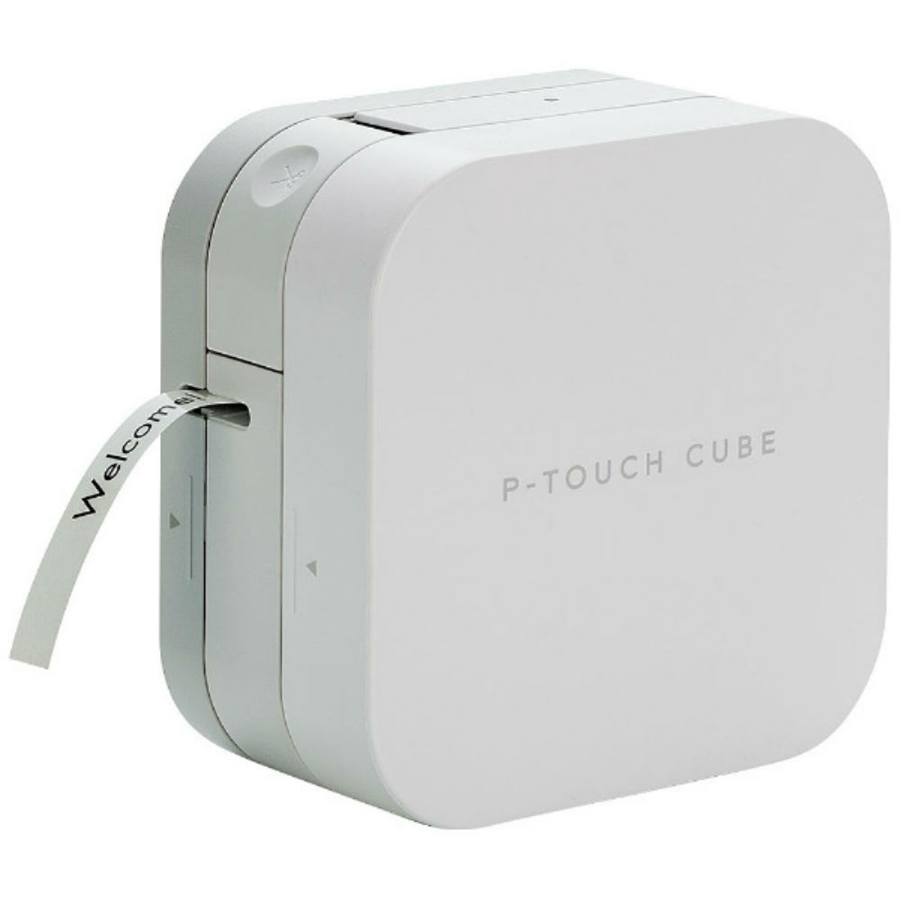
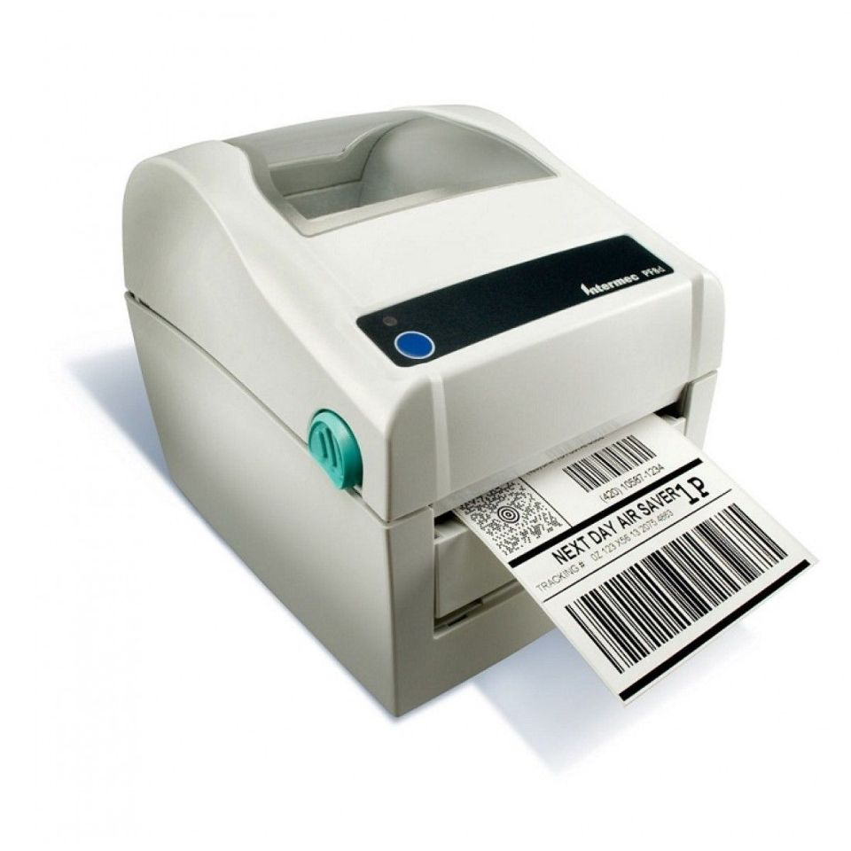
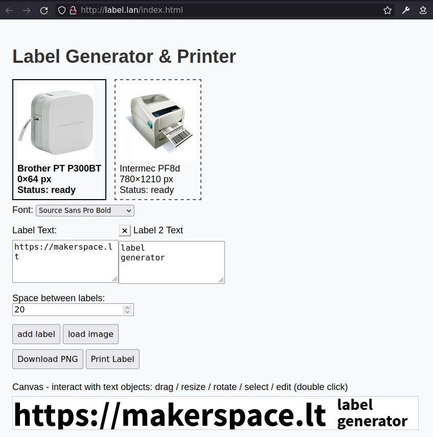

# Kaunas Makerspace Label Generator and Printer

This is a web frontend and backend for label printers

We are running it on a Raspberry Pi Zero.

## Supported Label Printers

| Brother PT P300BT | Intermec PF8d |
| ---------------------------------------- | --------------------------------------- |
|  |  |
| 64px height labels                       |                                         |
| communication over bluetooth             |                                         |

## Setup

1. Boot your Raspberry Pi Zero and install git:
   ```
   sudo apt install -y git
   ```
2. Checkout this repo on the Pi: 
   ```
   git clone https://github.com/makerspacelt/label-printer-service.git
   ```
3. Connect to your Brother printer via bluetooth: run `bluetoothctl` and enter the following commands in its prompt.
   ```
   power on                                                                                
   scan on                                                                                 
   agent on                                                                                
   ```
   Wait a little for the scan to complete. Then enter `devices` bluetoothctl command. You should see the Brother printer devices mac. Run `pair` & `trust` with its mac:
   ```
   pair <mac>
   trust <mac>
   ```
4. Run the setup script:
   ```
   cd label-printer-service
   scripts/setup.sh
   ```
5. That's it!

The script should install and autostart 3 systemd services:
1. `rfcomm0.service` to connect to Brother's bluetooth serial and bind it to `/dev/rfcomm0` device.
2. `esim-web.service` - PHP backend for the Intermec PF8d printer.
3. `label-lan.service` - runs an HTTP backend on port 80 which
   serves the label generator frontend & the Brother printer
   backend.

## Web Frontend Screenshot




